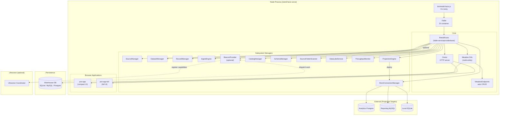
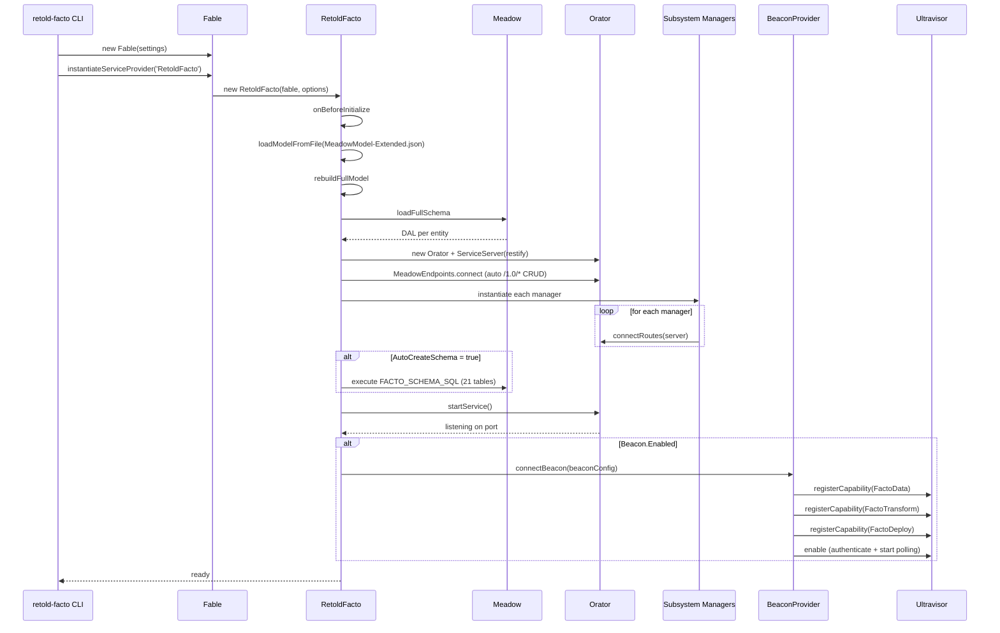
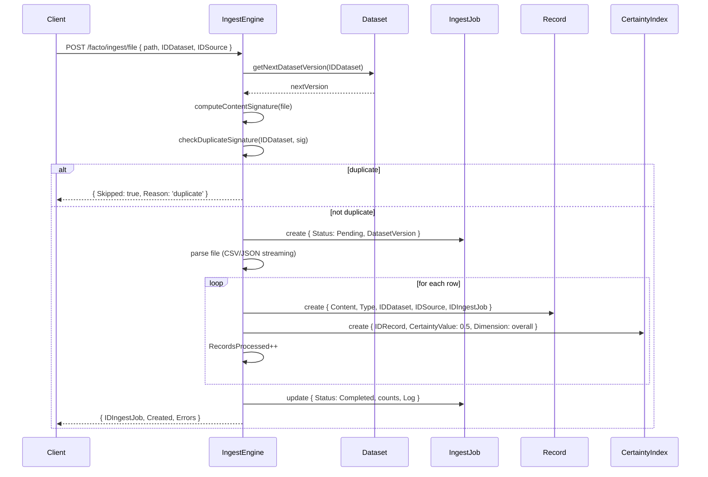
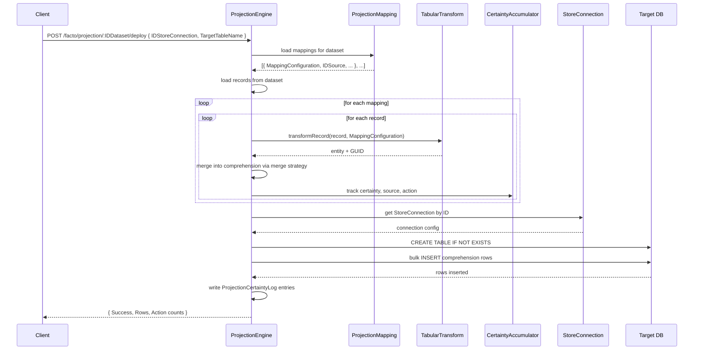

# Architecture

Facto is a Fable service provider that hosts an Orator REST server, a Meadow-backed data access layer, a pair of Pict web applications, and an optional Ultravisor beacon. All twelve subsystems run in-process as Fable-managed services.

## Process Layout



## Class Hierarchy

```mermaid
classDiagram
	class libFableServiceProviderBase {
		+fable
		+options
		+log
	}

	class RetoldFacto {
		+fullModel
		+entityList
		+models
		+loadModel(name, object, provider, cb)
		+loadModelFromFile(name, path, filename, cb)
		+rebuildFullModel()
		+createSchema(cb)
		+isEndpointGroupEnabled(name)
		+initializeService(cb)
		+startService(cb)
		+stopService(cb)
	}

	class RetoldFactoSourceManager {
		+connectRoutes(server)
	}

	class RetoldFactoDatasetManager {
		+connectRoutes(server)
	}

	class RetoldFactoRecordManager {
		+ingestSingleRecord(data, cb)
		+connectRoutes(server)
	}

	class RetoldFactoIngestEngine {
		+ingestFile(path, idDataset, idSource, opts, cb)
		+ingestJSON(data, idDataset, idSource, opts, cb)
		+ingestCSV(content, idDataset, idSource, opts, cb)
		+getNextDatasetVersion(idDataset, cb)
		+computeContentSignature(content)
		+checkDuplicateSignature(idDataset, sig, cb)
		+appendJobLog(idJob, message, cb)
		+connectRoutes(server)
	}

	class RetoldFactoProjectionEngine {
		+compileProjection(idDataset, config, cb)
		+deploySchema(idDataset, idConn, table, cb)
		+discoverProjectionFields(idDataset, cb)
		+importProjectionMapping(idDataset, json, cb)
		+connectRoutes(server)
	}

	class RetoldFactoCatalogManager {
		+findOrCreateSource(name, defaults, cb)
		+findOrCreateDataset(name, defaults, cb)
		+ensureDatasetSourceLink(idDS, idSrc, cb)
		+connectRoutes(server)
	}

	class RetoldFactoStoreConnectionManager {
		+_maskConfig(json)
		+_mergeConfig(newCfg, storedCfg)
		+connectRoutes(server)
	}

	class RetoldFactoSchemaManager {
		+_parseMicroDDL(ddl)
		+_computeSchemaHash(text)
		+connectRoutes(server)
	}

	class RetoldFactoSourceFolderScanner {
		+addScanPath(folder, cb)
		+getDiscoveredDatasets()
		+provisionDataset(path, cb)
		+ingestDataset(path, opts, cb)
		+connectRoutes(server)
	}

	class RetoldFactoBeaconProvider {
		+connectBeacon(config, cb)
		+disconnectBeacon(cb)
	}

	libFableServiceProviderBase <|-- RetoldFacto
	libFableServiceProviderBase <|-- RetoldFactoSourceManager
	libFableServiceProviderBase <|-- RetoldFactoDatasetManager
	libFableServiceProviderBase <|-- RetoldFactoRecordManager
	libFableServiceProviderBase <|-- RetoldFactoIngestEngine
	libFableServiceProviderBase <|-- RetoldFactoProjectionEngine
	libFableServiceProviderBase <|-- RetoldFactoCatalogManager
	libFableServiceProviderBase <|-- RetoldFactoStoreConnectionManager
	libFableServiceProviderBase <|-- RetoldFactoSchemaManager
	libFableServiceProviderBase <|-- RetoldFactoSourceFolderScanner
	libFableServiceProviderBase <|-- RetoldFactoBeaconProvider
	RetoldFacto --> RetoldFactoSourceManager
	RetoldFacto --> RetoldFactoDatasetManager
	RetoldFacto --> RetoldFactoRecordManager
	RetoldFacto --> RetoldFactoIngestEngine
	RetoldFacto --> RetoldFactoProjectionEngine
	RetoldFacto --> RetoldFactoCatalogManager
	RetoldFacto --> RetoldFactoStoreConnectionManager
	RetoldFacto --> RetoldFactoSchemaManager
	RetoldFacto --> RetoldFactoSourceFolderScanner
	RetoldFacto --> RetoldFactoBeaconProvider
```



## Startup Sequence



## Ingest Flow



## Projection Compile + Deploy Flow



## Ultravisor Relationship

Facto's relationship with Ultravisor is **optional but intentional**. The same operations that are available over REST (`/facto/record/ingest`, `/facto/projection/.../deploy`, etc.) are also exposed as beacon capabilities (`FactoData`, `FactoTransform`, `FactoDeploy`). This gives you two ways to drive Facto:

1. **Direct REST** -- a client (script, Pict UI, curl) calls the REST endpoints.
2. **Ultravisor workflow** -- a workflow running on an Ultravisor coordinator dispatches work items that match one of Facto's registered capabilities; the beacon polls, picks up the work, executes it against the same internal services, and returns the result.

The two paths share every service under the hood -- there is no duplicate code for beacon vs REST. The beacon mode is primarily a packaging layer that exposes the same managers through a different transport.

Typical deployment patterns:

- **Single-node development** -- one `retold-facto serve` running on a developer laptop, no Ultravisor involved
- **Production warehouse** -- `retold-facto serve` with its REST API behind an internal load balancer; applications query Facto directly
- **Distributed ingest** -- several Facto beacons running close to data sources (one per region, one per data partner), all registered with a central Ultravisor coordinator that orchestrates nightly ingest pipelines
- **Hybrid** -- a single production Facto instance that also registers as a beacon, so workflows can dispatch to it by name while the REST API remains available for ad-hoc queries

See [Ultravisor Integration](ultravisor-integration.md) for the full capability contract.

## File Layout

```
retold-facto/
├── README.md
├── package.json
├── bin/
│   └── retold-facto.js                          # CLI entry point
├── source/
│   ├── Retold-Facto.js                          # main service provider
│   └── services/
│       ├── Retold-Facto-BeaconProvider.js       # Ultravisor beacon
│       ├── Retold-Facto-RecordManager.js
│       ├── Retold-Facto-IngestEngine.js
│       ├── Retold-Facto-ProjectionEngine.js     # largest subsystem
│       ├── Retold-Facto-SourceManager.js
│       ├── Retold-Facto-DatasetManager.js
│       ├── Retold-Facto-CatalogManager.js
│       ├── Retold-Facto-StoreConnectionManager.js
│       ├── Retold-Facto-SchemaManager.js
│       ├── Retold-Facto-SourceFolderScanner.js
│       ├── Retold-Facto-DataLakeService.js
│       ├── Retold-Facto-ThroughputMonitor.js
│       └── web-app/
│           ├── pict-app/                         # compact UI
│           └── pict-app-full/                    # full UI
├── test/
│   ├── RetoldFacto_tests.js                     # Mocha TDD
│   ├── Facto_Browser_Integration_tests.js       # Puppeteer
│   └── model/
│       ├── MeadowModel-Extended.json            # schema
│       └── ddl/Facto.ddl
├── documentation/
│   └── source_research/                          # example research READMEs
└── docs/
	├── README.md, _cover.md, _sidebar.md, _topbar.md
	├── quickstart.md
	├── architecture.md
	├── api-reference.md
	├── ultravisor-integration.md
	└── subsystems/
		├── recordset.md
		├── projection.md
		├── mapping.md
		├── connection.md
		└── audit.md
```

## Core Schema (21 Tables)

| Table | Purpose |
|---|---|
| `Source` | Data sources (name, type, URL, active) |
| `SourceDocumentation` | Research docs per source |
| `Dataset` | Data collections (Raw / Compositional / Projection / Derived) |
| `DatasetSource` | Many-to-many link with reliability weight |
| `Record` | Individual records with JSON content and versioning |
| `RecordBinary` | Binary attachments (mime type, storage key, size) |
| `CertaintyIndex` | Confidence metadata per record (dimension + justification) |
| `IngestJob` | Batch metadata (status, counts, content signature, log) |
| `SourceCatalogEntry` | Catalog index entries |
| `CatalogDatasetDefinition` | Catalog dataset hints (format, parse options, version policy) |
| `MultiSetProjection` | Multi-source projection pipeline |
| `ProjectionStore` | Deployment targets for a projection |
| `ProjectionMapping` | Transform rules (Entity, GUIDTemplate, Mappings) |
| `ProjectionCertaintyLog` | Merge history and per-action certainty |
| `StoreConnection` | External database connections |
| `FactoSchema` | Schema definitions (stricture or manyfest) |
| `SchemaDocumentation` | Schema docs |
| `SchemaVersion` | Schema version history |
| `ThroughputEvent` | Per-stage performance metrics |
| (plus auxiliary tables) | |

See the individual subsystem guides for the detailed columns on each.

## Configuration Surface

| Key | Purpose |
|---|---|
| `StorageProvider` | `SQLite`, `MySQL`, `PostgreSQL`, or `MSSQL` |
| `FullMeadowSchemaPath` / `FullMeadowSchemaFilename` | Where to load the stricture schema from |
| `AutoInitializeDataService` | Initialize Meadow on startup |
| `AutoStartOrator` | Start the Orator server automatically |
| `AutoCreateSchema` | Execute `FACTO_SCHEMA_SQL` on startup |
| `Endpoints.*` | Enable / disable individual subsystem REST routes |
| `Facto.RoutePrefix` | REST prefix for subsystem endpoints (default `/facto`) |
| `Facto.DefaultCertaintyValue` | Default `CertaintyIndex.CertaintyValue` (0.0-1.0) |
| `Facto.ScanPaths` | Folders for `SourceFolderScanner` to discover datasets in |
| `Facto.Beacon.*` | Optional Ultravisor beacon configuration |

See [Ultravisor Integration](ultravisor-integration.md) for the beacon configuration shape.
