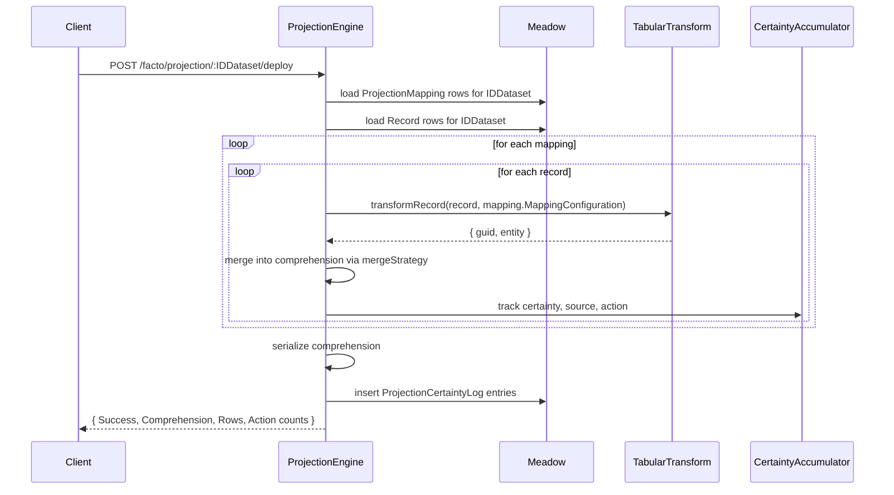
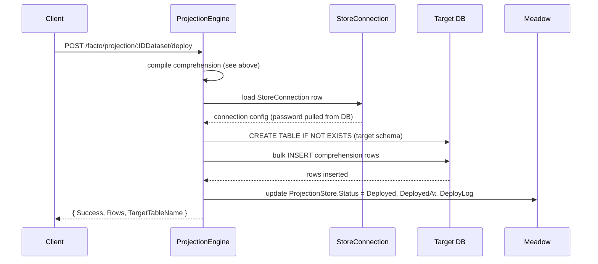

# Projection Subsystem

Projections are Facto's answer to "how do I turn raw records into something a BI tool or application can actually use?". A projection is a flat, denormalized view derived from one or more raw datasets via declarative [mappings](mapping.md), merged using a configurable strategy, and deployed to any Meadow-supported backend through the [connection subsystem](connection.md).

This is the largest subsystem in Facto. `Retold-Facto-ProjectionEngine.js` is ~3,900 lines and owns compilation, mapping CRUD, field discovery, deployment, querying, certainty analysis, and comparison.

## Concepts

A **projection** is a dataset with `Type = 'Projection'`. It does not store raw records; it stores *pointers* to the mappings and stores that compute it.

A **mapping** describes how to turn a raw record into a projection entity. Multiple mappings can point at the same projection -- one per source feeding it.

A **projection store** is a specific deployment target for a projection: a `StoreConnection` (where to write) and a `TargetTableName` (what to call the table). A projection can have many stores so you can deploy the same projection to multiple backends.

A **comprehension** is the compiled, de-duped output of running every mapping against every record. It is a map from entity GUIDs (computed by each mapping's `GUIDTemplate`) to merged record bodies. Comprehensions live in `/facto/projection/:IDDataset/comprehensions` and are the thing that gets written to the target store during deploy.

A **merge strategy** tells the projection engine what to do when two records produce the same GUID. Facto ships with five built-in strategies.

## Schema

### `Dataset` (projection rows)

A projection is just a dataset with `Type = 'Projection'`:

```
IDDataset          ID
Name               'World Cities Canonical'
Type               'Projection'
VersionPolicy      'Replace' | 'Append' | 'Upsert'
...
```

### `MultiSetProjection`

The pipeline definition for a multi-source projection:

```
IDMultiSetProjection   ID
IDDataset              FK (the projection this pipeline produces)
IDProjectionStore      FK (the default target for this pipeline)
Name                   'Canonical City Merge'
Description            long text
PipelineConfiguration  JSON: { sources: [...], mergeStrategy: '...', ... }
Active                 0 or 1
```

### `ProjectionStore`

A deployment target for a projection:

```
IDProjectionStore    ID
IDDataset            FK
IDStoreConnection    FK (where to write)
TargetTableName      'world_cities_canonical'
Status               'Pending' | 'Deployed' | 'Failed'
DeployedAt           last successful deploy time
DeployLog            text log from the last deploy
```

### `ProjectionMapping`

A transform rule for converting records into projection entities:

```
IDProjectionMapping    ID
IDDataset              FK
IDSource               FK (which source this mapping handles)
IDProjectionStore      FK (which target the mapping feeds)
Name                   'GeoNames to Canonical City'
MappingConfiguration   JSON: { Entity, GUIDTemplate, Mappings }
SchemaVersion          integer
FlowDiagramState       JSON (visual state for the web UI)
Active                 0 or 1
```

See [Mapping subsystem](mapping.md) for the full `MappingConfiguration` shape.

### `ProjectionCertaintyLog`

A per-action log of the merge process:

```
IDProjectionCertaintyLog  ID
IDMultiSetProjection      FK
RecordGUID                the entity GUID produced by a mapping
CertaintyValue            float 0.0-1.0
SourceMappingLabel        which mapping ran
IDProjectionMapping       FK
Action                    'Created' | 'Merged' | 'Overwritten' | 'Skipped'
Details                   JSON with the specific fields that were written
```

The certainty log is what lets you ask "why does this cell in the projection have this value?".

## Merge Strategies

When two mappings produce a record with the same `GUIDTemplate` result, the projection engine applies a merge strategy to decide what the final row should look like.

| Strategy | Behavior |
|---|---|
| `WriteAll` | Merge all fields from the new record into the existing one; new values overwrite existing values. Default. |
| `FirstWriteWins` | The first record wins. Subsequent records for the same GUID are logged but not applied. |
| `ReliabilityOverwrite` | The record from the source with the higher `DatasetSource.ReliabilityWeight` wins. Ties go to the first write. |
| `MergeAndReinforce` | Merge all fields. For each field, the certainty is recomputed as `max(existing, new)`. Useful when you want multiple independent confirmations to raise confidence. |
| `FieldFillOnly` | Fill only fields that are currently `null` or empty in the existing record. Never overwrites an existing value. |

The strategy is set on `MultiSetProjection.PipelineConfiguration.mergeStrategy`. You can implement a custom strategy by subclassing `RetoldFactoProjectionEngine` and adding an entry to its `MERGE_STRATEGIES` object (each strategy is a function `(pNewRecord, pExistingRecord, pContext) => mergedRecord`).

## Services

### `RetoldFactoProjectionEngine`

The entire projection pipeline lives in this one service. Developer-facing methods:

```javascript
compileProjection(pIDDataset, pConfig, fCallback)
// Load mappings + records, apply merge strategy, return the comprehension.
// pConfig: { mergeStrategy, certaintyMode, ... } (optional)
// fCallback: (pError, pComprehension)

deploySchema(pIDDataset, pIDStoreConnection, pTargetTableName, fCallback)
// Compile the projection AND write the result to an external store.
// Creates the target table if it does not exist, bulk-inserts rows.
// fCallback: (pError, pDeployReport)

discoverProjectionFields(pIDDataset, fCallback)
// Inspect a sample of records and produce a candidate schema for the projection.
// Used by the web UI to auto-populate the projection schema editor.
// fCallback: (pError, pFieldList)

importProjectionMapping(pIDDataset, pMappingJSON, fCallback)
// Import a mapping from a file; creates or updates a ProjectionMapping row.
// fCallback: (pError, pMapping)
```

All four methods are also exposed through REST endpoints -- see below.

## REST Endpoints

### Discovery

| Method | Path | Purpose |
|---|---|---|
| `GET` | `/facto/projections` | List every dataset of type `Projection` |
| `GET` | `/facto/projections/summary` | Aggregate counts of projections, mappings, and stores |

### Query

| Method | Path | Purpose |
|---|---|---|
| `POST` | `/facto/projections/query` | Parameterized query against a projection store |
| `POST` | `/facto/projections/aggregate` | Aggregation query (sum, count, avg, group by) |
| `POST` | `/facto/projections/certainty` | Certainty distribution analysis |
| `POST` | `/facto/projections/compare` | Side-by-side comparison of two projections |

### Schema

| Method | Path | Purpose |
|---|---|---|
| `GET` | `/facto/projection/:IDDataset/schema` | Current projection schema |
| `POST` | `/facto/projection/:IDDataset/save-schema` | Save an edited schema |
| `POST` | `/facto/projection/:IDDataset/discover-fields` | Auto-discover fields from a record sample |

### Stores

| Method | Path | Purpose |
|---|---|---|
| `GET` | `/facto/projection/:IDDataset/stores` | List deployment targets |
| `POST` | `/facto/projection/:IDDataset/deploy` | Compile and deploy to a store |

### Mappings

| Method | Path | Purpose |
|---|---|---|
| `GET` | `/facto/projection/:IDDataset/mappings` | List mappings |
| `GET` | `/facto/projection/mapping/:IDProjectionMapping` | Fetch a mapping |
| `POST` | `/facto/projection/:IDDataset/mapping` | Create a mapping |
| `POST` | `/facto/projection/mapping/:IDProjectionMapping/update` | Update a mapping |
| `POST` | `/facto/projection/:IDDataset/import` | Import a mapping JSON |

### Comprehensions

| Method | Path | Purpose |
|---|---|---|
| `GET` | `/facto/projection/:IDDataset/comprehensions` | List compiled comprehensions on disk |
| `GET` | `/facto/projection/:IDDataset/comprehension/:Filename` | Fetch a single comprehension |

## The Compile Flow



The core loop is "for each mapping, for each record, transform and merge". `TabularTransform` lives in `meadow-integration` and is the pure function that applies a `MappingConfiguration` to a single record.

## The Deploy Flow



Facto uses the Meadow connector for the target database, so any backend Meadow supports is automatically a valid deployment target.

## Typical Flows

### Create a New Projection

```bash
# 1. Create the projection dataset
curl -X POST http://localhost:8386/1.0/Dataset \
	-H 'Content-Type: application/json' \
	-d '{"Name":"World Cities Canonical","Type":"Projection","VersionPolicy":"Replace"}'
# => { IDDataset: 5 }

# 2. Add mappings (one per source)
curl -X POST http://localhost:8386/facto/projection/5/mapping \
	-H 'Content-Type: application/json' \
	-d '{
		"Name":     "GeoNames",
		"IDSource": 1,
		"MappingConfiguration": {
			"Entity":       "City",
			"GUIDTemplate": "City_{country_iso}_{asciiname}",
			"Mappings": {
				"Name":        "{name}",
				"Country":     "{country_iso}",
				"Latitude":    "number({latitude})",
				"Longitude":   "number({longitude})",
				"Population":  "number({population})"
			}
		}
	}'

curl -X POST http://localhost:8386/facto/projection/5/mapping \
	-H 'Content-Type: application/json' \
	-d '{
		"Name":     "OpenStreetMap",
		"IDSource": 2,
		"MappingConfiguration": {
			"Entity":       "City",
			"GUIDTemplate": "City_{country_code}_{name_ascii}",
			"Mappings": {
				"Name":      "{name}",
				"Country":   "{country_code}",
				"Latitude":  "number({lat})",
				"Longitude": "number({lon})"
			}
		}
	}'

# 3. Deploy to a target store
curl -X POST http://localhost:8386/facto/projection/5/deploy \
	-H 'Content-Type: application/json' \
	-d '{"IDStoreConnection":1,"TargetTableName":"world_cities_canonical"}'
```

### Query the Projection

Once deployed, the target table is queryable in the target database directly. Facto also provides a query proxy for convenience:

```bash
curl -X POST http://localhost:8386/facto/projections/query \
	-H 'Content-Type: application/json' \
	-d '{
		"IDDataset":     5,
		"IDStoreConnection": 1,
		"Table":         "world_cities_canonical",
		"Filter":        { "Country": "US" },
		"Sort":          { "Population": "desc" },
		"Limit":         100
	}'
```

### Analyze Certainty

```bash
curl -X POST http://localhost:8386/facto/projections/certainty \
	-H 'Content-Type: application/json' \
	-d '{"IDDataset":5,"GroupBy":"Country"}'

# {
#   "Success": true,
#   "Distribution": [
#     { "Country": "US", "AvgCertainty": 0.89, "Count": 30000 },
#     { "Country": "DE", "AvgCertainty": 0.91, "Count": 11000 },
#     ...
#   ]
# }
```

## Beacon Capability

When beacon mode is enabled, the deploy operation is available as the `DeploySchema` action on the `FactoDeploy` capability:

```json
{
	"Capability": "FactoDeploy",
	"Action":     "DeploySchema",
	"Input":
	{
		"IDDataset":         5,
		"IDStoreConnection": 1,
		"TargetTableName":   "world_cities_canonical"
	}
}
```

The compile step runs identically regardless of whether it was invoked through REST or through an Ultravisor dispatch.

## Cross-References

- [Mapping subsystem](mapping.md) -- the transform DSL that drives projection compilation
- [Connection subsystem](connection.md) -- where deployment targets are configured
- [Recordset subsystem](recordset.md) -- the raw records the projection engine reads
- [Audit subsystem](audit.md) -- `ProjectionCertaintyLog` is the projection-specific audit trail
- [Ultravisor Integration](../ultravisor-integration.md) -- `FactoDeploy.DeploySchema`
