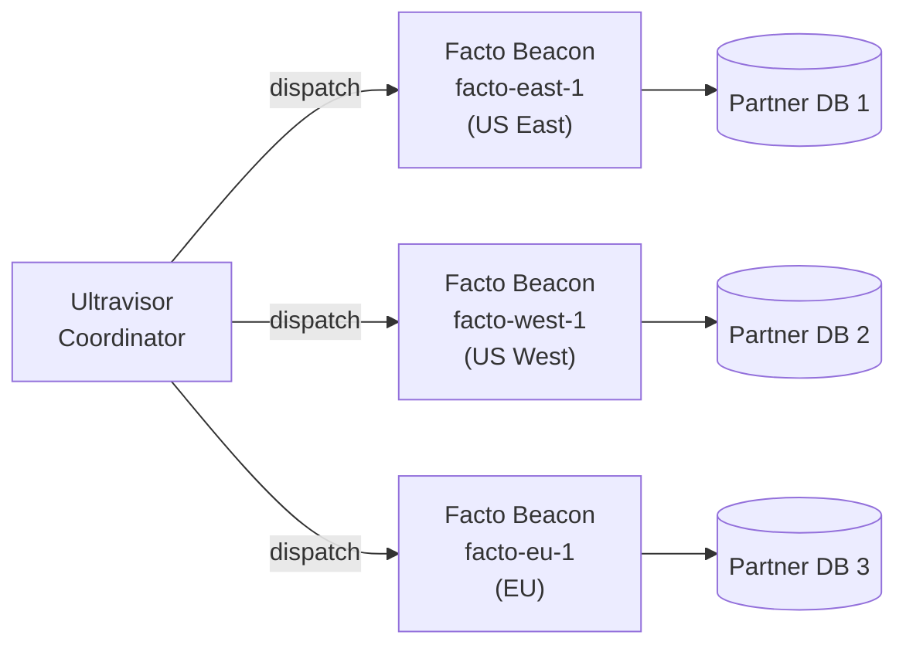
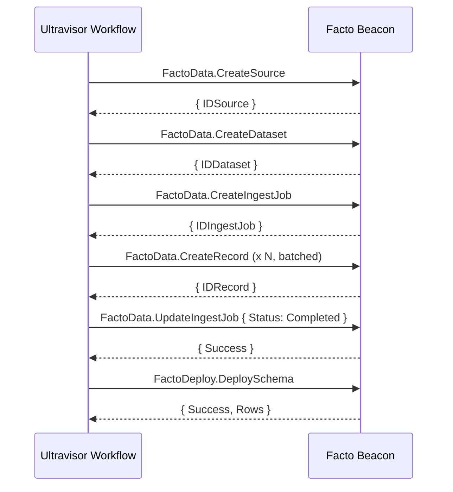

# Ultravisor Integration

Facto can register as an [Ultravisor](https://github.com/stevenvelozo/ultravisor) beacon and expose its operations as workflow capabilities. This document covers the relationship, the contract, and the deployment patterns that use it.

## The Relationship, In One Paragraph

**Ultravisor is the workflow engine. Facto is one of the warehouses Ultravisor orchestrates.** A Facto instance running with `--beacon` registers three named capabilities (`FactoData`, `FactoTransform`, `FactoDeploy`) with an Ultravisor coordinator and then polls the coordinator for work items. When a workflow step asks for one of those capabilities, the coordinator dispatches it to a registered Facto beacon, which executes the operation against its local warehouse and returns the result. The same code paths (RecordManager, ProjectionEngine, StoreConnectionManager) handle both beacon dispatches and direct REST calls -- the beacon is a transport, not a second implementation.

## Optional, Intentional

Beacon mode is strictly optional:

- **Facto without Ultravisor.** Works exactly as the [Quick Start](quickstart.md) describes: `retold-facto serve` gives you a REST API, a web UI, and a CLI. No beacon is registered. This is the right mode for single-node warehouses, local development, and situations where external orchestration is not needed.
- **Facto with Ultravisor.** Adding the beacon configuration makes the exact same Facto instance *also* reachable over the Ultravisor beacon protocol. The REST API and web UI continue to work alongside the beacon.

There is no operational mode where Facto requires Ultravisor. The dependency flows the other way: Ultravisor workflows can depend on Facto beacons, but a running Facto is not conscious of its Ultravisor status unless it is explicitly configured to be.

## When to Enable Beacon Mode

Enable the beacon when:

- You have more than one Facto instance (one per region, one per data partner, one per tenant) and you want a single workflow engine to coordinate them.
- You want long-running data pipelines to be retry-aware, resumable, and observable through Ultravisor's workflow history instead of scripts and cron jobs.
- You have other Retold beacons (file parsers, transform services, storage connectors) that need to hand off work to Facto.
- You want to separate "who runs the pipeline" from "where the data lives" -- Ultravisor owns the first, Facto owns the second.

Skip the beacon when:

- You have a single warehouse and drive it directly from application code.
- You are in early development and the extra moving parts would slow iteration.
- Your orchestration lives elsewhere (Airflow, Dagster, etc.) and calls Facto through its REST API directly.

## Configuration

Beacon mode is enabled through the `Facto.Beacon` section of the Fable settings:

```json
{
	"Facto":
	{
		"Beacon":
		{
			"Enabled":       true,
			"ServerURL":     "http://ultravisor-coordinator:8000",
			"Name":          "facto-east-1",
			"Password":      "beacon-secret",
			"MaxConcurrent": 5,
			"StagingPath":   "/tmp/facto-staging",
			"Tags":
			{
				"environment": "production",
				"tier":        "data-warehouse",
				"region":      "us-east-1"
			}
		}
	}
}
```

| Key | Purpose |
|---|---|
| `Enabled` | Master switch. When false (default), no beacon is registered. |
| `ServerURL` | URL of the Ultravisor coordinator this beacon reports to. |
| `Name` | Beacon identity. Must be unique per coordinator; used to route work. |
| `Password` | Shared secret for the beacon handshake. |
| `MaxConcurrent` | Maximum work items the beacon will execute concurrently. |
| `StagingPath` | Working directory for files the beacon needs to stage (e.g. during large ingest). |
| `Tags` | Free-form key/value metadata sent to the coordinator at registration. Ultravisor workflows can use tags to select which beacon(s) should receive work. |

The `ultravisor-beacon` module is not a hard `package.json` dependency of Facto; it is expected to be available in your Node module path when beacon mode is enabled. Install it alongside Facto when you need beacon support:

```bash
npm install retold-facto ultravisor-beacon
```

## The Three Capabilities

`RetoldFactoBeaconProvider.connectBeacon(...)` registers three named capabilities with the Ultravisor coordinator. Each capability groups one or more actions that workflows can dispatch.

### 1. `FactoData` -- Data CRUD

Exposes record-level operations against the Facto warehouse. Every action runs against the live Meadow DAL -- the same one the REST API uses.

| Action | Input | Output |
|---|---|---|
| `CreateSource` | `{ Name, Type, URL, Description }` | `{ IDSource }` |
| `CreateDataset` | `{ Name, Type, Description }` | `{ IDDataset }` |
| `CreateIngestJob` | `{ IDSource, IDDataset, Status }` | `{ IDIngestJob }` |
| `CreateRecord` | `{ IDDataset, IDSource, IDIngestJob, Content, Type }` | `{ IDRecord }` |
| `ReadRecords` | `{ IDDataset, Filter, Cap }` | `{ Records: [...] }` |
| `UpdateIngestJob` | `{ IDIngestJob, Status, RecordsProcessed, RecordsCreated, ... }` | `{ Success }` |
| `CreateProjectionStore` | `{ IDDataset, IDStoreConnection, TargetTableName }` | `{ IDProjectionStore }` |

`FactoData` is what a workflow uses to build up a warehouse state from the outside. A typical ingest workflow dispatches `CreateSource` -> `CreateDataset` -> `CreateIngestJob` -> N × `CreateRecord` -> `UpdateIngestJob(status=Completed)`.

### 2. `FactoTransform` -- Pure Mapping Execution

Exposes the mapping engine as a pure function: given a batch of records and a mapping configuration, return the comprehension (de-duped output entities) without writing anything to the warehouse.

| Action | Input | Output |
|---|---|---|
| `ApplyMapping` | `{ Records, MappingConfiguration }` | `{ Comprehension, BadRecords, ParsedRowCount, UniqueCount }` |

`MappingConfiguration` is the same `Entity + GUIDTemplate + Mappings` JSON documented in the [Mapping subsystem](subsystems/mapping.md).

This capability has no side effects. It is used by workflows that want to transform data on the same machine where the data lives without having to ship records over the network to a transform-only beacon first.

### 3. `FactoDeploy` -- Projection Deployment

Exposes the projection deployment operation as a workflow step.

| Action | Input | Output |
|---|---|---|
| `DeploySchema` | `{ IDDataset, IDStoreConnection, TargetTableName }` | `{ Success, Rows, Action counts }` |

`DeploySchema` loads the projection mapping for the dataset, runs it over every record, applies the configured merge strategy, and writes the comprehension to the target store. It is the beacon-dispatched equivalent of `POST /facto/projection/:IDDataset/deploy`.

## Capability Code

The beacon registers its capabilities inside `RetoldFactoBeaconProvider.connectBeacon(...)`:

```javascript
this._BeaconService = this.fable.instantiateServiceProviderWithoutRegistration(
	'UltravisorBeacon',
	{
		ServerURL:     pBeaconConfig.ServerURL,
		Name:          pBeaconConfig.Name || 'retold-facto',
		Password:      pBeaconConfig.Password,
		MaxConcurrent: pBeaconConfig.MaxConcurrent || 5,
		StagingPath:   pBeaconConfig.StagingPath,
		Tags:          pBeaconConfig.Tags || {}
	});

this._BeaconService.registerCapability(
{
	Capability: 'FactoData',
	Actions:
	{
		CreateSource:          /* ... */,
		CreateDataset:         /* ... */,
		CreateIngestJob:       /* ... */,
		CreateRecord:          /* ... */,
		ReadRecords:           /* ... */,
		UpdateIngestJob:       /* ... */,
		CreateProjectionStore: /* ... */
	}
});

this._BeaconService.registerCapability(
{
	Capability: 'FactoTransform',
	Actions:
	{
		ApplyMapping: /* ... */
	}
});

this._BeaconService.registerCapability(
{
	Capability: 'FactoDeploy',
	Actions:
	{
		DeploySchema: /* ... */
	}
});

this._BeaconService.enable(fCallback);   // authenticate + start polling
```

Each action is a plain function `(pInput, fCallback)` that calls into the appropriate Facto service manager and invokes the callback with the result.

## Workflow Patterns

### Pattern 1: Distributed Ingest Fan-Out

Ultravisor dispatches file-ingest operations to several Facto beacons running close to their data sources. Each beacon sees only the data partner it is deployed alongside.



The workflow has one definition; the deployment topology selects which beacon receives each dispatch via tags.

### Pattern 2: Ingest Then Deploy

A single workflow walks through the five-step pipeline that the [ultravisor-suite-harness](/apps/ultravisor-suite-harness/) uses against Facto:



The workflow is a linear pipeline; Ultravisor handles retry, tracing, and observability across the steps.

### Pattern 3: Transform-Only Fan-Out

A workflow picks up raw records from a source beacon, hands them to a Facto beacon for transform (via `FactoTransform.ApplyMapping`), then passes the comprehension to another beacon for storage. Facto is used purely as a transform worker without writing anything to its own warehouse.

This pattern is useful when you have a centralized warehouse that is not Facto, but you want to use Facto's mapping engine for the transform step.

### Pattern 4: Hybrid Direct + Beacon

A single Facto instance runs with the beacon enabled and its REST API exposed. Internal applications hit the REST API for ad-hoc queries and web UI navigation; Ultravisor workflows dispatch through the beacon for scheduled ingest and deploy operations. Both paths share state in the same warehouse.

This is the most common production pattern for teams that are already using Ultravisor.

## Starting Facto With a Beacon

There are three ways to enable beacon mode:

**1. Config file (recommended):**

```bash
retold-facto serve --config ./facto-beacon.json
```

With `facto-beacon.json`:

```json
{
	"Facto":
	{
		"Beacon":
		{
			"Enabled":   true,
			"ServerURL": "http://ultravisor-coordinator:8000",
			"Name":      "facto-east-1",
			"Password":  "beacon-secret"
		}
	}
}
```

**2. Programmatic (embedding Facto in another Node process):**

```javascript
const libFable       = require('fable');
const libRetoldFacto = require('retold-facto');

const _Fable = new libFable({
	Product: 'MyFactoHost',
	Facto:
	{
		Beacon:
		{
			Enabled:   true,
			ServerURL: 'http://ultravisor-coordinator:8000',
			Name:      'facto-east-1',
			Password:  'beacon-secret'
		}
	}
});

_Fable.serviceManager.addServiceType('RetoldFacto', libRetoldFacto);
const _Facto = _Fable.instantiateServiceProvider('RetoldFacto', {});

_Facto.initializeService((pError) =>
{
	// ... beacon is registered and polling
});
```

**3. Post-start (for tests or admin tooling):**

```javascript
_Facto.services.RetoldFactoBeaconProvider.connectBeacon(
	{
		ServerURL: 'http://ultravisor-coordinator:8000',
		Name:      'facto-test-1',
		Password:  'test-secret'
	},
	(pError, pBeaconInfo) =>
	{
		// pBeaconInfo = { BeaconID: '...', Status: 'registered' }
	});
```

## Disconnecting Cleanly

On shutdown, call `disconnectBeacon` to tell the coordinator this beacon is going away. `RetoldFacto.stopService()` does this for you when beacon mode is enabled:

```javascript
_Facto.stopService(() =>
{
	// HTTP server stopped, beacon disconnected
});
```

## Operations Files

Unlike some Ultravisor beacons (including the ones used by `ultravisor-suite-harness`), Facto **does not ship operation JSON files**. Its capabilities are registered inline in `BeaconProvider.connectBeacon(...)` with concrete action handlers. If you want to dispatch Facto work from a workflow, you define the operation on the Ultravisor side -- pointing at the capability names (`FactoData`, `FactoTransform`, `FactoDeploy`) and action names that Facto registers.

## Security Notes

- The beacon shares a plain-text password with the coordinator. Keep it out of version control. Use environment variables or a secrets store, not a config file checked into your repo.
- Facto's REST API is still exposed when beacon mode is enabled. Put it behind a firewall or an auth proxy if the beacon is running in an untrusted network.
- Credentials for projection targets (MySQL, Postgres) are stored in `StoreConnection.Config` as JSON with the password field masked in API responses. A beacon-dispatched `DeploySchema` operation reads the password from the database, not from the dispatch payload, so workflow authors never see it.

## Troubleshooting

| Symptom | Likely Cause | Fix |
|---|---|---|
| Beacon never connects | Wrong `ServerURL` or `Password` | Check the Ultravisor coordinator logs for handshake failures |
| Capabilities registered but no work arrives | Workflow target tags do not match beacon tags | Double-check the `Tags` section and the workflow's beacon selector |
| Work arrives but fails with "entity not found" | Beacon is pointed at a different warehouse than the workflow expects | Check `StorageProvider` / database path on the Facto side |
| `ultravisor-beacon` module not found | Beacon mode enabled but the module is not installed | `npm install ultravisor-beacon` alongside Facto |
| Beacon disconnects after a few minutes | Coordinator evicted it due to missed heartbeats | Increase `MaxConcurrent` or investigate slow work items blocking the poll loop |
